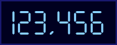
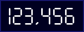
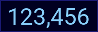
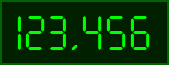

A PHP web visitor counter inspired by the WWW Homepage Access Counter (Count.cgi) made 
by Muhammad A Muquit. (https://www.muquit.com/muquit/software/Count/Count.html) Returns 
a PNG image with the current visitor count. 

Requires PHP (tested on 7.2) and the GD module. 

Examples:

/Counter/?datafile=ExampleCounter



/Counter/?datafile=ExampleCounter&font_color=white



/Counter/?datafile=ExampleCounter&font=Roboto-Regular



/Counter/?datafile=ExampleCounter&font=SevenSegment&font_color=lime&background_color=darkdarkgreen&frame_color=darkgreen



Options that can be passed via URL:
|Option             |Description                                                     |
|-------------------|----------------------------------------------------------------|
|datafile           |**Required** - Counter data file name                           |
|font               |Name of font located in font_dir to be used (no .ttf extension) |
|font_size          |Point size to use                                               |
|font_color         |Font color (see colors.inc)                                     |
|background_color   |Background color (see colors.inc)                               |
|number_format      |Whether to format number with commas                            |
|frame_thickness    |Thickness in pixels of outside frame                            |
|frame_color        |Color of outside frame (see colors.inc)                         |

All of these except for datafile are optional and have defaults defined in the index.php file.

The data file must be pre created and writable by the user the web server processes run as.

Example:
```
echo 1 > SomeDataFile
chown webserveruser SomeDataFile
chmod u+rw SomeDataFile
```

Note that you may need to change the file SElinux context and/or enable file writing for your webserver if you are using SElinux and are having issues (see ls -laZ and chcon commands). 

Sources:

Colors for colors.inc:

https://www.w3.org/TR/css-color-3/#svg-color

Bundled Fonts:

https://fonts.google.com/specimen/Roboto

http://www.styleseven.com/php/get_product.php?product=Digital-7

https://www.kraftilab.com/portfolio/square-dot-matrix-display-font/

https://www.kraftilab.com/portfolio/7-segment-display-font/

https://www.kraftilab.com/portfolio/led-dot-matrix-display-font/
